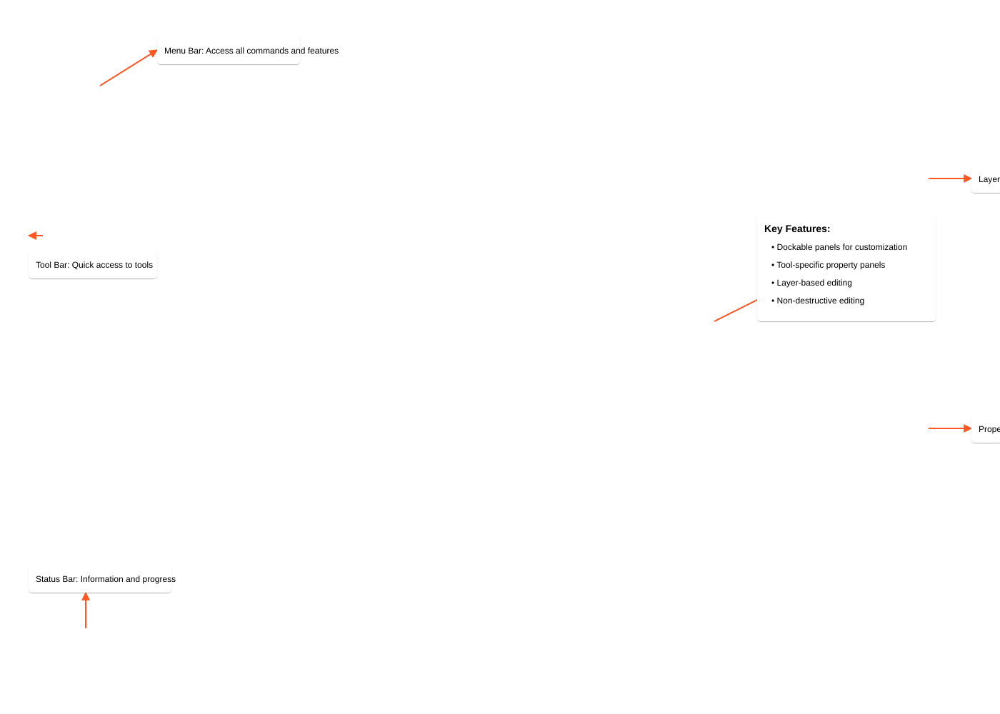

# HelixZone User Guide

Welcome to HelixZone! This guide will help you understand and use all the features available in the application.

## Table of Contents
- [Getting Started](#getting-started)
- [Interface Overview](#interface-overview)
- [Basic Operations](#basic-operations)
- [Tools and Features](#tools-and-features)
- [Advanced Techniques](#advanced-techniques)
- [Keyboard Shortcuts](#keyboard-shortcuts)
- [Tips and Best Practices](#tips-and-best-practices)

## Getting Started

### Launching HelixZone
1. Open your terminal or command prompt
2. Activate your virtual environment:
   ```bash
   # Windows
   .\helixzone-env\Scripts\activate
   
   # macOS/Linux
   source helixzone-env/bin/activate
   ```
3. Launch HelixZone:
   ```bash
   python -m helixzone
   ```

### Creating a New Project
1. Click `File > New` or press `Ctrl+N`
   
2. Choose your canvas size
3. Select background color or transparency
4. Click "Create"

### Opening Existing Images
1. Click `File > Open` or press `Ctrl+O`
2. Navigate to your image file
3. Select the file and click "Open"

## Interface Overview

HelixZone provides a powerful and intuitive interface designed for efficient image editing. The main interface is organized into several key areas:



The interface consists of:

1. **Menu Bar**: Access all commands and features through organized menus
2. **Tool Bar**: Quick access to frequently used tools
3. **Canvas Area**: Main editing area where your image is displayed
4. **Layers Panel**: Manage and organize image layers
5. **Properties Panel**: Configure tool-specific options
6. **Status Bar**: View important information and progress updates

### Key Features

- **Dockable Panels**: Customize your workspace by rearranging panels
- **Tool-specific Properties**: Each tool has its own set of configurable options
- **Layer-based Editing**: Non-destructive editing with full layer support
- **Real-time Preview**: See changes instantly as you work

### Main Window Components


The main window consists of several key components:
- **Menu Bar**: Access all features and commands
- **Tool Bar**: Quick access to commonly used tools
- **Canvas**: Main editing area
- **Layers Panel**: Manage image layers
- **Tool Options**: Configure selected tool settings

### Panels and Docks


All panels are dockable and can be rearranged:
- Right-click panel headers to:
  - Float panel
  - Change position
  - Hide/show panel

### Canvas Navigation


- **Zoom**: Mouse wheel or `Ctrl++`/`Ctrl+-`
- **Pan**: Middle mouse button drag or Space+Left click
- **Rotate**: `Alt+Right` click drag
- `Ctrl+0`: Fit to screen

## Basic Operations

### Layer Management
1. **Creating Layers**
   - Click "+" in Layers panel
   - `Layer > New Layer`
   - `Ctrl+Shift+N`

2. **Layer Properties**
   - Opacity: Slider in Layers panel
   - Blend Mode: Dropdown in Layers panel
   - Visibility: Eye icon toggle

3. **Layer Operations**
   - Move: Select Move tool (V)
   - Transform: `Ctrl+T`
   - Merge: Select layers, `Ctrl+E`
   - Delete: Select layer, press Delete

### Selection Tools

1. **Rectangle Selection**
   
   - Click Rectangle tool or press M
   - Click and drag to create selection
   - Hold Shift for square
   - Hold Alt to select from center

2. **Elliptical Selection**
   
   - Click Ellipse tool or press M
   - Click and drag to create selection
   - Hold Shift for circle
   - Hold Alt to select from center

3. **Lasso Selection**
   
   - Click Lasso tool or press L
   - Click and drag to draw freeform selection
   - Double-click or return to start point to close

4. **Magnetic Lasso**
   
   
   The Magnetic Lasso tool provides intelligent edge detection for precise selections. As you move the cursor near edges in your image, the tool automatically snaps to them, making it easier to create accurate selections around complex shapes.
   
   
   
   - Click Magnetic Lasso tool
   - Click to start
   - Move along edges (snaps automatically)
   - Double-click to complete
   
   **Tool Options:**
   - Edge Contrast: Adjust sensitivity to edge detection
   - Width: Set the detection area width
   - Frequency: Control point placement frequency
   - Edge Fit: Fine-tune edge snapping behavior

### Selection Options
- **Feathering**
  - Adjust radius in Tool Options
  - Higher values = softer edges
  - Apply before or after selection

- **Selection Modes**
  - New: Create new selection
  - Add: Hold Shift
  - Subtract: Hold Alt
  - Intersect: Hold Shift+Alt

## Tools and Features

### Image Adjustments
1. **Color Adjustments**
   
   - Levels: `Image > Adjustments > Levels`
   - Curves: `Image > Adjustments > Curves`
   - Hue/Saturation: `Image > Adjustments > Hue/Saturation`

2. **Filters**
   
   - Blur: `Filter > Blur`
   - Sharpen: `Filter > Sharpen`
   - Noise: `Filter > Noise`

### Brush Tools
1. **Basic Brush**
   
   - Size: [ and ] keys
   - Hardness: Shift+[ and Shift+]
   - Opacity: Number keys (1-0)
   - Flow: Shift+number keys

2. **Eraser**
   
   - Works like brush
   - Respects layer transparency
   - Can use brush presets

### Advanced Selection
1. **Content-Aware Fill**
   
   - Make selection
   - `Edit > Fill > Content-Aware`
   - Adjust adaptation parameters

2. **Refine Edge**
   
   - Make initial selection
   - Click "Refine Edge"
   - Adjust parameters:
     - Radius
     - Smoothness
     - Feather
     - Contrast

## Advanced Techniques

### Working with Masks
1. **Layer Masks**
   - Add mask: Layer panel mask icon
   - Paint black to hide
   - Paint white to show
   - Gray for partial transparency

2. **Clipping Masks**
   - Alt+Click between layers
   - Or use `Layer > Create Clipping Mask`

### Color Management
1. **Color Spaces**
   - RGB: Default for screen
   - CMYK: For print
   - LAB: For advanced color editing

2. **Color Profiles**
   - Set in `Edit > Color Settings`
   - Match to output device
   - Convert when needed

### Photo Enhancement Workflow


Follow this professional workflow to enhance your photos:

1. **Basic Adjustments**
   - Crop and straighten
   - Adjust exposure and contrast
   - Fine-tune white balance

2. **Color Enhancement**
   - Vibrance and saturation
   - Color balance
   - Selective color adjustments

3. **Detail Enhancement**
   - Sharpen details
   - Reduce noise
   - Apply local contrast

4. **Final Touches**
   - Vignette
   - Color grading
   - Export for web or print

## Keyboard Shortcuts

### File Operations
- `Ctrl+N`: New file
- `Ctrl+O`: Open file
- `Ctrl+S`: Save
- `Ctrl+Shift+S`: Save as
- `Ctrl+W`: Close file

### Edit Operations
- `Ctrl+Z`: Undo
- `Ctrl+Shift+Z`: Redo
- `Ctrl+X`: Cut
- `Ctrl+C`: Copy
- `Ctrl+V`: Paste
- `Ctrl+A`: Select all

### Tool Shortcuts
- `V`: Move tool
- `M`: Rectangle/Elliptical selection
- `L`: Lasso tools
- `B`: Brush tool
- `E`: Eraser tool
- `G`: Gradient tool
- `I`: Eyedropper tool

### View Controls
- `Ctrl++`: Zoom in
- `Ctrl+-`: Zoom out
- `Ctrl+0`: Fit to screen
- `Ctrl+1`: 100% view
- `Tab`: Toggle panels
- `Space`: Hold for Pan tool

## Tips and Best Practices

### Performance Optimization
1. **Memory Management**
   - Use appropriate image sizes
   - Merge layers when possible
   - Clear undo history if needed

2. **GPU Acceleration**
   - Enable in preferences
   - Monitor GPU memory usage
   - Close other GPU applications

### File Management
1. **File Formats**
   - PSD: For editing
   - PNG: For web with transparency
   - JPEG: For web without transparency
   - TIFF: For print

2. **Backup Strategy**
   - Save incrementally
   - Use version control
   - Keep original files

### Workflow Tips
1. **Non-Destructive Editing**
   - Use adjustment layers
   - Work with masks
   - Keep original layers

2. **Organization**
   - Name layers descriptively
   - Group related layers
   - Use color coding

### Common Pitfalls to Avoid
1. **Image Quality**
   - Don't scale up raster images
   - Maintain appropriate resolution
   - Use correct color space

2. **Performance**
   - Don't create unnecessary layers
   - Clean up unused resources
   - Monitor system resources

## Getting Help
- Press F1 for context-sensitive help
- Check our [FAQ section](FAQ.md)
- Visit our [GitHub Issues](https://github.com/helixzone/issues)
- Join our [Discord community](https://discord.gg/helixzone) 